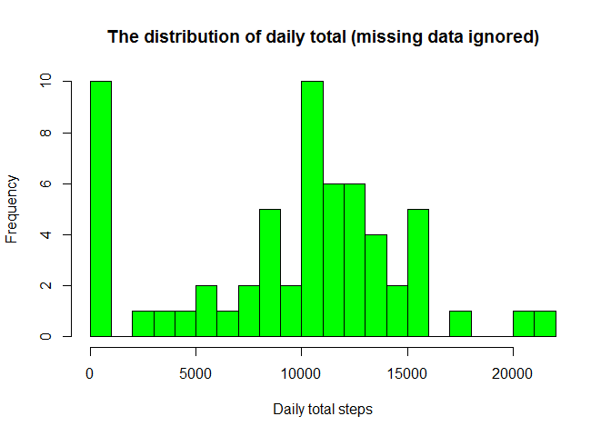
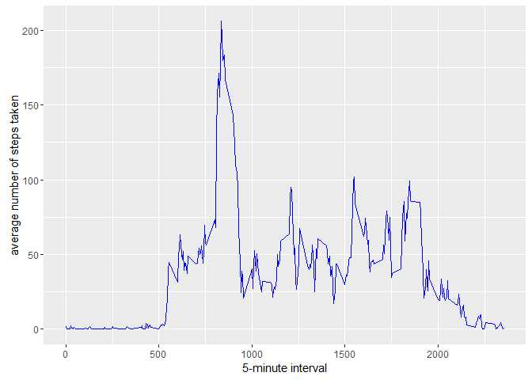
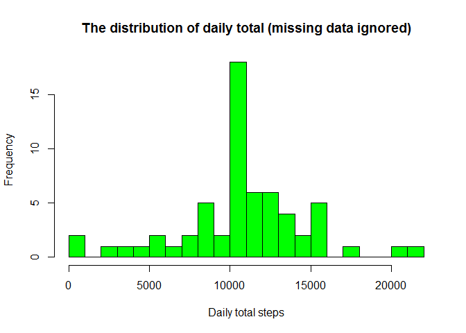
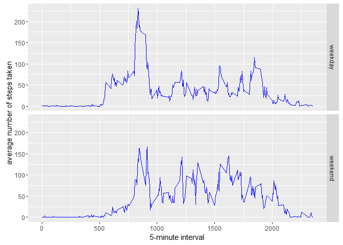

# Reproducible Research: Peer Assessment 1


## Loading and preprocessing the data

Unzip data to obtain a csv file and read the csv file.


```r
unzip("activity.zip")
activity <- read.csv("activity.csv")
```
## What is mean total number of steps taken per day?


```r
library(ggplot2)
```

```
## Warning: package 'ggplot2' was built under R version 3.2.5
```

```r
total.steps <- tapply(activity$steps, activity$date, FUN = sum, na.rm = TRUE)
hist(x=total.steps,
     col="green",
     breaks=20,
     xlab="Daily total steps",
     ylab="Frequency",
     main="The distribution of daily total (missing data ignored)")
```

<!-- -->

```r
mean(total.steps, na.rm=TRUE)
```

```
## [1] 9354.23
```

```r
median(total.steps, na.rm=TRUE)
```

```
## [1] 10395
```

## What is the average daily activity pattern?

```r
library(ggplot2)
averages <- aggregate(x=list(steps=activity$steps), by=list(interval=activity$interval),
                      FUN=mean, na.rm=TRUE)
ggplot(data=averages, aes(x=interval, y=steps)) +
    geom_line(col= "blue") +
    xlab("5-minute interval") +
    ylab("average number of steps taken")
```

<!-- -->


On average across all the days in the dataset, the 5-minute interval contains the maximum number of steps?

```r
averages[which.max(averages$steps),]
```

```
##     interval    steps
## 104      835 206.1698
```

## Imputing missing values

How many days have missing values?

```r
library(ggplot2)
missingdata <- sum(is.na(activity$steps))
```

Fill the missing values with the mean value

```r
print(paste("There are", missingdata, "missing data points."))
```

```
## [1] "There are 2304 missing data points."
```

```r
value.fill <- function(steps, interval) {
    fillvalue <- NA
    if (!is.na(steps))
        fillvalue <- c(steps)
    else
        fillvalue <- (averages[averages$interval==interval, "steps"])
    return(fillvalue)
}
datana <- activity
datana$steps <- mapply(value.fill, datana$steps, datana$interval)
```

Create a histogram to show total number of steps taken each day and calculate the mean and median total number of steps.

```r
total.steps <- tapply(datana$steps, datana$date, FUN = sum, na.rm = TRUE)
hist(x=total.steps,
     col="green",
     breaks=20,
     xlab="Daily total steps",
     ylab="Frequency",
     main="The distribution of daily total (missing data ignored)")
```

<!-- -->

```r
mean(total.steps, na.rm=TRUE)
```

```
## [1] 10766.19
```

```r
median(total.steps, na.rm=TRUE)
```

```
## [1] 10766.19
```

## Are there differences in activity patterns between weekdays and weekends?

Using the above dataset to find the day of the week for each measurement

```r
weekday.or.weekend <- function(date) {
    day <- weekdays(date)
    if (day %in% c("Monday", "Tuesday", "Wednesday", "Thursday", "Friday"))
        return("weekday")
    else if (day %in% c("Saturday", "Sunday"))
        return("weekend")
    else
        stop("invalid date")
}
datana$date <- as.Date(datana$date)
datana$day <- sapply(datana$date, FUN=weekday.or.weekend)
```

Making a plot for calculating average number of steps taken
on weekdays and weekends.

```r
averages <- aggregate(steps ~ interval + day, data=datana, mean)
ggplot(data=averages, aes(x=interval, y=steps)) +
    geom_line(col= "blue") +facet_grid(day ~ .) +
    xlab("5-minute interval") +
    ylab("average number of steps taken")
```

<!-- -->

